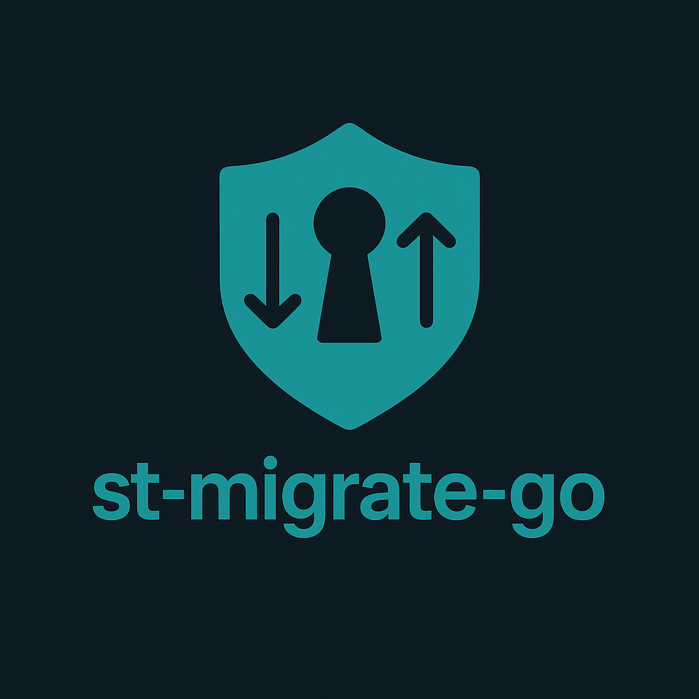

<!-- Improved compatibility of back to top link: See: https://github.com/othneildrew/Best-README-Template/pull/73 -->
<a id="readme-top"></a>

<div align="center">

[![Contributors][contributors-shield]][contributors-url]
[![Forks][forks-shield]][forks-url]
[![Stargazers][stars-shield]][stars-url]
[![Issues][issues-shield]][issues-url]
[![License][license-shield]][license-url]

<!-- PROJECT LOGO -->
<br />
<div align="center">
  <a href="https://github.com/BeardedWonderDev/st-migrate-go">
    
  </a>

  <p align="center">
    <a href="https://github.com/BeardedWonderDev/st-migrate-go/issues">Report Bug</a>
    ·
    <a href="https://github.com/BeardedWonderDev/st-migrate-go/issues">Request Feature</a>
  </p>
</div>

<h3>SuperTokens role/permission migrations with golang-migrate style sources, as an SDK and CLI.</h3>

</div>

<!-- TABLE OF CONTENTS
<details>
  <summary>Table of Contents</summary>
  <ol>
    <li><a href="#about-the-project">About The Project</a>
      <ul>
        <li><a href="#built-with">Built With</a></li>
      </ul>
    </li>
    <li><a href="#getting-started">Getting Started</a>
      <ul>
        <li><a href="#prerequisites">Prerequisites</a></li>
        <li><a href="#installation">Installation</a></li>
      </ul>
    </li>
    <li><a href="#usage">Usage</a></li>
    <li><a href="#roadmap">Roadmap</a></li>
    <li><a href="#contributing">Contributing</a></li>
    <li><a href="#license">License</a></li>
    <li><a href="#contact">Contact</a></li>
    <li><a href="#acknowledgments">Acknowledgments</a></li>
  </ol>
</details> -->

<!-- ABOUT THE PROJECT -->
## About The Project

st-migrate-go lets you manage SuperTokens roles and permissions using golang-migrate–style migration sources. It keeps migrate’s filename-based ordering, adds schema-versioned YAML for future evolution, and ships as both a Go SDK and a CLI.
- **SDK (`st-migrate/`)** to embed in Go services.
- **CLI (`cmd/st-migrate-go`)** for terminal or CI/CD use.

Key behaviors:
- Order is defined by filenames (`0001_name.up.yaml` / `.down.yaml`).
- YAML `version` is the schema version (v1 today); filenames control execution order.
- Works with golang-migrate sources; state can be file-based (default) or any migrate DB driver (postgres/mysql/sqlite registered in the CLI).
- Default executor calls `supertokens-golang`; you can plug in your own.

<p align="right">(<a href="#readme-top">back to top</a>)</p>

### Built With

- [Go](https://go.dev/)
- [Cobra](https://github.com/spf13/cobra)
- [golang-migrate](https://github.com/golang-migrate/migrate)
- [SuperTokens Go SDK](https://github.com/supertokens/supertokens-golang)

<p align="right">(<a href="#readme-top">back to top</a>)</p>

<!-- GETTING STARTED -->
## Getting Started

Follow these steps to install and run the CLI, or embed the SDK in your Go application.

### Prerequisites
- Go 1.20+ (tested with 1.24)
- Access to your SuperTokens instance for applying role changes

### Installation
1. Clone the repo
   ```sh
   git clone https://github.com/BeardedWonderDev/st-migrate-go.git
   cd st-migrate-go
   ```
2. Install the CLI (or download a release binary)
   ```sh
   go install ./cmd/st-migrate-go
   ```
3. (Optional) Vendor dependencies
   ```sh
   go mod tidy
   ```
4. Verify
   ```sh
   st-migrate-go --help
   ```

<p align="right">(<a href="#readme-top">back to top</a>)</p>

<!-- USAGE EXAMPLES -->
## Usage

### CLI
```sh
# Show current and pending migrations
st-migrate-go --source file://backend/migrations/auth status

# Apply all pending migrations
st-migrate-go up

# Apply up to a target version
st-migrate-go up 5

# Roll back one migration (default) or N steps
st-migrate-go down
st-migrate-go down 2

# Generate paired up/down files with the next version number
st-migrate-go create add-reporting-roles
```
Flags:
- `--source` migrate-style source URL (default `file://backend/migrations/auth`)
- `--database` migrate database driver URL for state tracking (postgres, mysql, sqlite registered in CLI build)
- `--state-file` path to a JSON state store used when `--database` is empty (default `.st-migrate/state.json`)
- `--dry-run` log actions without executing or mutating state
- `--verbose` enable debug logging

Typical workflows:
- Bootstrap everything: `st-migrate-go up`
- Targeted deploy: `st-migrate-go up 7`
- Rollback last step: `st-migrate-go down`
- Create a new migration pair: `st-migrate-go create add-audit-role`

### SDK
```go
cfg := stmigrate.Config{
    SourceURL: "file://backend/migrations/auth",
    // Optional: Store, Executor, Logger, DryRun, Registry
}
r, err := stmigrate.New(cfg)
if err != nil {
    // handle
}
defer r.Close()
if err := r.Up(context.Background(), nil); err != nil {
    // handle
}
```

Using a golang-migrate database driver (example: Postgres):
```go
import (
    "github.com/BeardedWonderDev/st-migrate-go/st-migrate"
    "github.com/golang-migrate/migrate/v4/database/postgres"
    _ "github.com/lib/pq"
)

// create or reuse *sql.DB ...
db, _ := sql.Open("postgres", "<dsn>")
driver, _ := postgres.WithInstance(db, &postgres.Config{})
cfg := stmigrate.Config{
    SourceURL: "file://backend/migrations/auth",
    Store:     stmigrate.WrapMigrateDatabase(driver),
}
r, _ := stmigrate.New(cfg)
defer r.Close()
_ = r.Up(context.Background(), nil)
```

YAML schema v1:
```yaml
version: 1          # schema version
actions:
  - role: app:admin
    ensure: present  # present|absent (default present)
    add: [app:read, app:write]
    remove: []
```

<p align="right">(<a href="#readme-top">back to top</a>)</p>

<!-- ROADMAP -->
## Roadmap

- Add additional sources (embed, git, s3)
- Schema v2 exploration (richer permission metadata)
- Advisory locking strategy for multi-runner safety

See the [open issues](https://github.com/BeardedWonderDev/st-migrate-go/issues) for a full list of proposed features and known issues.

<p align="right">(<a href="#readme-top">back to top</a>)</p>

<!-- CONTRIBUTING -->
## Contributing

Contributions are welcome! Please open an issue to discuss changes before submitting a PR. Keep changes small and covered by tests.

<p align="right">(<a href="#readme-top">back to top</a>)</p>

<!-- LICENSE -->
## License

This project is licensed under the Apache License 2.0. See `LICENSE.txt` for details.

<p align="right">(<a href="#readme-top">back to top</a>)</p>

<!-- CONTACT -->
## Contact

Project Link: [https://github.com/BeardedWonderDev/st-migrate-go](https://github.com/BeardedWonderDev/st-migrate-go).  
If you need to reach us, please open an issue describing your question or request.

<p align="right">(<a href="#readme-top">back to top</a>)</p>

<!-- ACKNOWLEDGMENTS -->
## Acknowledgments

- [golang-migrate](https://github.com/golang-migrate/migrate)
- [SuperTokens](https://supertokens.com/)
- [Cobra](https://github.com/spf13/cobra)
- [Best-README-Template](https://github.com/othneildrew/Best-README-Template)

<p align="right">(<a href="#readme-top">back to top</a>)</p>

<!-- MARKDOWN LINKS & IMAGES -->
[contributors-shield]: https://img.shields.io/github/contributors/BeardedWonderDev/st-migrate-go.svg?style=for-the-badge
[contributors-url]: https://github.com/BeardedWonderDev/st-migrate-go/graphs/contributors
[forks-shield]: https://img.shields.io/github/forks/BeardedWonderDev/st-migrate-go.svg?style=for-the-badge
[forks-url]: https://github.com/BeardedWonderDev/st-migrate-go/network/members
[stars-shield]: https://img.shields.io/github/stars/BeardedWonderDev/st-migrate-go.svg?style=for-the-badge
[stars-url]: https://github.com/BeardedWonderDev/st-migrate-go/stargazers
[issues-shield]: https://img.shields.io/github/issues/BeardedWonderDev/st-migrate-go.svg?style=for-the-badge
[issues-url]: https://github.com/BeardedWonderDev/st-migrate-go/issues
[license-shield]: https://img.shields.io/github/license/BeardedWonderDev/st-migrate-go.svg?style=for-the-badge
[license-url]: https://github.com/BeardedWonderDev/st-migrate-go
